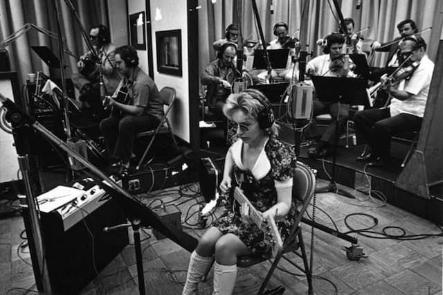
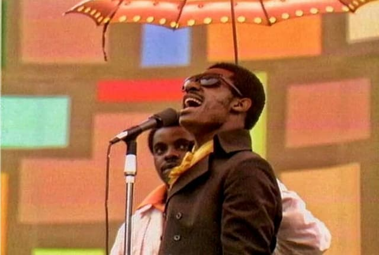

Esta é a última newsletter do ano. Imagino que você, como eu, já esteja cansado de notícias sobre política e tecnologia. Então, nesta edição, vou fazer apenas duas recomendações de filmes sobre música. Tenho evitado transformar a **Texto Sobre Tela** num "espaço de curadoria" e enfatizado a reflexão, mas já passou da hora de lhe dar um descanso do meu particular campo de distorção da realidade.

Aperte os cintos.

* * *

## A formação do "neoliberalismo musical"

No pós-Segunda Guerra Mundial, houve uma das maiores revoluções culturais que esse planeta já hospedou. Em algumas décadas, consolidou-se todo um sistema de identidade baseado em valores como o consumismo, o sonho (norte) americano, a liberdade individualista, a validação extrema da conveniência e do entretenimento. Se você acabou de fazer as compras de Natal no supermercado e saiu cheio de sacos plásticos, comida processada, vindas de marcas monopolistas, sabe de que revolução estou falando.

É fato que o cinema e, depois, a TV tiveram um enorme papel na difusão desse novo padrão civilizatório. Mas a música foi ainda mais importante nesse processo. Especialmente aquela que, mais tarde, seria conhecida como "pop". Ela era a trilha sonora, um ponto de conexão emocional ainda mais direto na formação daquilo que viria a ser a _psique_ neoliberal, a nossa atual normalidade. Essa música englobava não só o nascente rock 'n roll, mas também versões mais palatáveis da cultura afro-americana, embrulhadas em discursos românticos e (então) levemente hedonistas.

Hoje, muitos de nós conhecemos figuras como a do produtor Phil Spector e sua linha de produção de hits. Além de nomes como Beach Boys, Righteous Brothers, Sony & Cher, The Mamas and The Papas, Nancy e Frank Sinatra, The Monkees, Elvis etc. Porém, bem menos gente ouviu falar do Wrecking Crew, um coletivo de cerca de 20 músicos que gravava praticamente todos os discos dos artistas, até mesmo coisas mais experimentais, como o clássico [Pet Sounds](https://en.wikipedia.org/wiki/Pet_Sounds). Naquela época, a situação [Mili & Vanilli](https://pt.wikipedia.org/wiki/Milli_Vanilli) era a regra e não uma vergonha autoral.

O documentário [The Wrecking Crew!](https://www.imdb.com/title/tt1185418/)(2008), feito pelo filho de um dos guitarristas da super-banda, Tommy Tedesco, reúne histórias e imagens de cerca de três décadas de atividade do grupo. Também traz entrevistas com os membros sobreviventes.

É interessante pensar como seria o mundo sem a influência industrial do Wrecking Crew: a cultura pop teria se tornado tão hegemônica, caso a banda não fosse tão competente (e rápida) na criação de entretenimento? Como seria a cultura hoje se os próprios artistas tivessem tocado em seus álbuns? Vai saber.

Os membros do Wrecking Crew, assim como outros trabalhadores anônimos, apenas queriam manter suas carreiras e famílias, mas acabaram sendo peças-chave de uma revolução tão gigantesca, que informa nossos valores, expectativas e comportamentos até hoje.

_(O termo neoliberalismo aqui é usado de um jeito cômico, claro. Não é exatamente possível transpor uma ideologia econômica para a música. [E olha que eu já tentei](https://youtu.be/3jPuZA7jdoU?t=387).)_

## Paz, amor e groove

Responda rápido: qual é o nome daquele histórico festival que aconteceu em 1969, no Estado de Nova York, enquanto rolava a guerra no Vietnã? Woodstock? Nope. Estou falando do [Harlem Cultural Festival](https://en.wikipedia.org/wiki/Harlem_Cultural_Festival), a contrapartida afro-norte-americana para o outro evento, mais famoso, enlameado e branco.

O Harlem reuniu artistas como Nina Simone, Stevie Wonder, B.B. King, Sly & The Family Stone, além de mais de 300 mil pessoas na audiência. E, como a polícia de NY não quis cuidar da segurança, o organizador, [Tony Lawrence](https://en.wikipedia.org/wiki/Tony_Lawrence_(singer) "Tony Lawrence (singer)"), acabou convocando os Black Panters para o serviço. Isso numa época extremamente tensa, que vinha de uma sequência de assassinatos de líderes negros, como Malcom X e Martin Luther King. Sabe no que deu? Festa. Sem violência.

O festival foi todo filmado, mas, ao contrário de Woodstock, o material nunca foi exibido publicamente, até agora. Coube ao onipresente [Ahmir “Questlove” Thompson](https://en.wikipedia.org/wiki/Questlove "Questlove") resgatar as imagens e produzir o documentário _[Summer of Soul (...Or, When the Revolution Could Not Be Televised)](https://en.wikipedia.org/wiki/Summer_of_Soul "Summer of Soul")_, mostrando bastidores e partes significativas dos shows (como Stevie Wonder mandando um solo de bateria). Filme obrigatório para quem, como eu, é fã de música negra dos anos 70.
