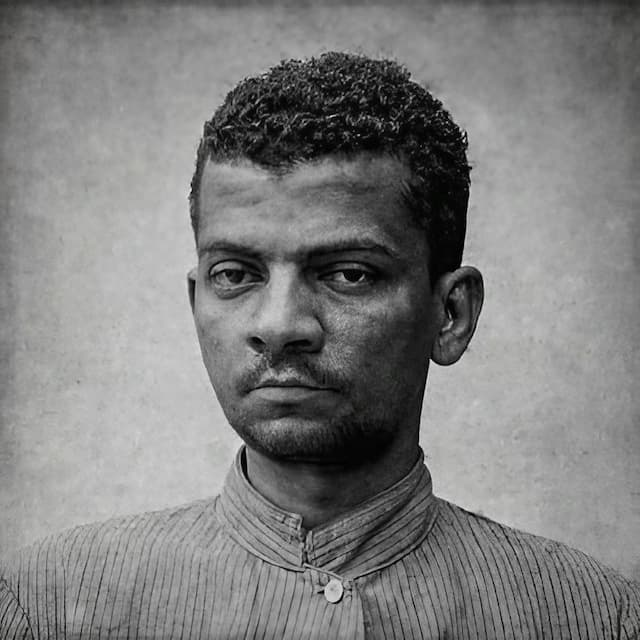

_Casey Neistat, que revolucionou o VLog, incorporando técnicas cinematográficas ao gênero._

Por estranho que pareça, até semana passada, eu meio que consegui ignorar um dos fenômenos mais populares da Internet, os VLogs. Obviamente, assisti a alguns ao longo dos anos. Mas não conhecia profundamente seus expoentes mais importantes, como [Casey Neistat](https://www.youtube.com/@casey) ou até [Andrew Callaghan](https://www.youtube.com/@Channel5YouTube).

Esse é o problema do viés pré-hipster anos 90: valorizar demais o que é obscuro e desqualificar de antemão o que faz sucesso.

Neistat (e seu irmão, [Van](https://www.youtube.com/@vanneistat)) revolucionaram os VLogs, usando técnicas cinematográficas e narrativas elaboradas. Callaghan vale um texto a parte: viajando pelas maiores bocadas dos EUA, trouxe um sabor de gonzo jornalismo ao seu trabalho, mostrando gente tão cotidiana que parece viver em outro planeta.

Mesmo que você não tenha assistido aos vídeos desses criadores, é certo que já se deparou com algumas técnicas que eles usaram à exaustão, na década passada. Muitas vazaram para a publicidade e para o jornalismo corporativo.

Em especial o estilo de Casey Neistat, que produz um conteúdo mais leve, bem-humorado, urbano, cheio de imagens de drones, música eletrônica repetitiva, fofinha e aquele tom motivacional que parece ter tomado o mundo de assalto. Já os influenciadores brasileiros influenciados por Callaghan estiveram ativos durante a campanha eleitoral do ano passado. Em especial no TikTok.

Mas o que eu queria dizer é o seguinte: pasmem, essa imersão no mundo dos VLogs _mainstream_ me fez lembrar de autores como Lima Barreto.

Nada a ver, mas tudo a ver.

Barreto (foto acima) escrevia em revistas populares de sua época, usando inúmeros pseudônimos. Falava sobre buracos nas ruas, políticos, personagens inusitados e as idiossincrasias da vida urbana. Tanto que pesquisadores conseguiram compilar seus textos em livro exatamente porque ele agia como uma espécie de Vloger. Mapeando e comparando visão que Barreto tinha do Rio de Janeiro, deduziram a autoria dos textos.

Claro, há inúmeras diferenças entre Casey Neistat e Lima Barreto. Época, país, cor da pele, conta bancária, uso da literatura culta e, obviamente, o meio: YouTube para um, revistas para outro.

Mas ambos produziam crônicas diariamente, sob condições adversas, metas de produção industriais e sob editores escorchantes (no caso de Neistat, as estatísticas e a caixa de comentários).

Neistat fez fortuna e ganhou acesso a benesses do mundo capitalista. Isso acabou sendo [incorporado ao seu conteúdo](https://www.youtube.com/watch?v=84WIaK3bl_s). Barreto fez muitas desavenças ao longo da carreira, graças às suas posições políticas. Morreu doente e sem recursos. Ganhou maior respeitabilidade ao longo das décadas seguintes.

A única coisa que parece unir os cronistas aos VLogers e inovadores do jornalismo (como Callaghan) é o rompimento da quarta-parede, a incorporação explícita da personalidade do autor na obra, a observação diária do espaço público, da cidade, do cotidiano. Além da correria da publicação periódica, em massa — a obrigação de se virar para extrair assuntos de qualquer coisa.

Enfim, tudo isso para dizer que, durante minha pesquisa profissional sobre os Vlogers, não conseguia deixar de imaginar como seriam as versões VLog dos cronistas brasileiros clássicos. Lima Barreto, Nelson Rodrigues (que chegou a fazer programas para a TV), Otto Lara Rezende, Carlos Drummond de Andrade, Machado de Assis, Rubem Braga, etc. É certo que eles não seriam motivacionais, como os dos irmãos Neistat.

Considerando que o jornalismo on-line incorpora cada vez mais as técnicas dos VLogs, que o arcabouço estético que as corporações de mídia usavam para sinalizar credibilidade dá lugar a âncoras carismáticos e (supostamente) informais, que a crônica deixa de ser uma coluna num canto do jornal para se tornar um gênero dominante, o que fariam, hoje, esses cronistas?

Sei lá. Só pensando alto aqui.
