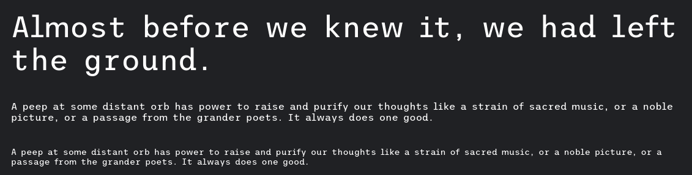
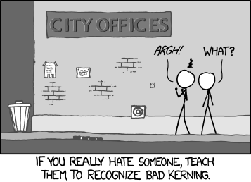
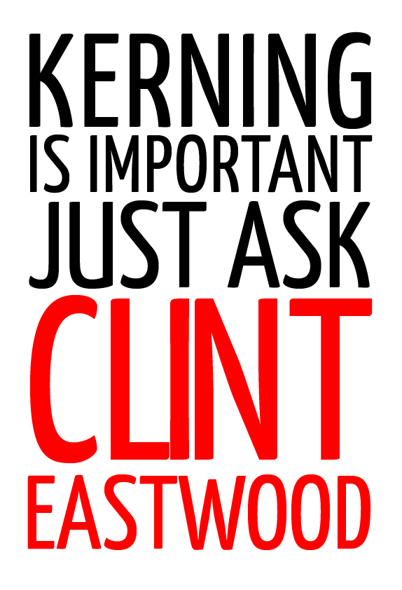

Vem ganhando popularidade na Internet o uso de fontes monoespaçadas híbridas. Isso quer dizer o seguinte:

**Fontes monoespaçadas** Cada caractere ocupa o mesmo espaço. Para que serve? Escrever códigos, programação. Exemplo: Inconsolata, Courier.

**Fontes híbridas** São baseadas na estética das monoespaçadas, mas trazem caracteres proporcionais, como na Arial, Georgia etc.

As imagens são de um [artigo no site iA](https://ia.net/topics/in-search-of-the-perfect-writing-font).

**Para quem isso é legal?** Para gente como eu, que gosta de escrever artigos e, especialmente roteiros, com fontes monoespaçadas. Porém, gosta da maior legibilidade das fontes proporcionais.

**Exemplos de fontes híbridas** [Trispace](https://fonts.google.com/specimen/Trispace)

[iA Writer Duospace](https://ia.net/topics/in-search-of-the-perfect-writing-font)

Não percebeu a diferença? Sem problemas, provavelmente, você não é um nerd de fontes. Não sou eu que vou destruir sua vida lhe ensinando o que é _kerning_ (espaçamento entre letras) ruim.

