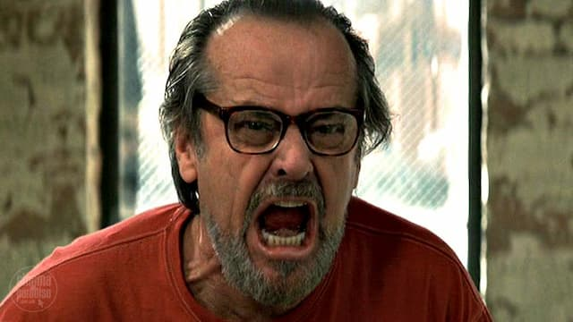

Dr. Distopia: Alô?

Eduf: Oi. Sou eu de novo.

DD _(respirando fundo)_: ...

E: Sei que ando ligando muito fora do horário das sessões...

DD _(sarcástico)_: Que bom que você percebeu isso. Notou também que são 2 da madrugada?

E: É que eu acho que estou ficando maluco.

DD: De novo?

E: Dessa vez é sério. Eu não consigo me lembrar mais das coisas que eu leio.

DD: Ok. Não sendo boleto ou sinal de trânsito... Você vai sobreviver.

E: Por exemplo, eu sei que estou puto, mas não me lembro mais a respeito do quê. Arthur do Val, Viagra para os militares, aquecimento global, guerra na Ucrânia, reforma no apartamento... Não consigo mais ligar a raiva ao motivo, entende? Quando abro um site de notícias, por exemplo, é quase como se minha visão se nublasse e tudo se tornasse uma coisa só.

DD: Então o problema é estar genericamente puto, é isso?

E: Sim. É. Indignado eu estou, isso é fato. Mas com o que, exatamente? Já começo a confundir as histórias e os nomes.

DD: Mas não confunde o sentimento de putosidade.

E: É. Fico o dia inteiro claramente puto.

DD: E você acha que se sentiria melhor se conseguisse organizar sua indignação, separar os assuntos, direcionar as energias para cada caso... Já tentou kanban? Scrum? Agile? Microsoft Teams?

E: Não sei se vai funcionar.

DD: Ué. Mas você não quer resolver os problemas para passar a raiva?

E: Não exatamente. Nem sei como fazer isso. Me sinto incapaz.

DD: Hmm... Então que tal simplesmente ignorar certas notícias?

E: Não, aí não. Seria um alienado.

DD: Então você _quer_ continuar indignado?

E: Bom. Eu não diria isso. Mas, se não tenho como mudar a realidade, pelo menos preciso reclamar, certo? _(Longa pausa.)_ Na verdade, nem sei mais como é viver sem estar genericamente puto.

DD: Quer dizer que ficar puto te traz alguma segurança?

E: Hmm...

DD: Traz uma espécie de alívio?

E: Será que dá pra chamar isso de alívio?

DD: Você que me responda.

E: Estou confuso. Acho que desenvolvi uma nova doença mental, tipo miopia de indignação, “mioputopia”.

DD: Mioputopia...

E: Tem uma coisa meio compulsiva também. Eu só procuro notícias e situações para ficar nervoso e frustrado. Só falo disso. Só penso nisso.

DD _(sarcástico)_: “Distúrbio obsessivo miotópico”.

E: Estou falando sério. Virei um urubu da Internet.

DD: Compreensível. As notícias não estão fáceis mesmo.

E: Mas eu estou falando de uma _toxidade tóxica_, sabe?

DD: Hum...

E: Por exemplo: se alguém pega o elevador comigo e puxa assunto sobre o tempo, vou acabar falando sobre desastres, bombas atômicas, digo que tem uma mancha na pele da pessoa que pode ser um câncer, falo sobre as últimas armações dos políticos...

DD: Não lhe ocorre nem uma coisa agradável para dizer?

E: Não!

DD: “Seu cabelo está bonito, hoje”...

E: Eu diria: “você sabe que tem petróleo e uma série de químicas perigosas no seu xampu?”

DD: Entendo.

E: Você acha que estou maluco?

DD: Não. Você está apenas desbalanceado.

E: Como assim?

DD: Está acompanhando demais um tipo específico de mídia. Isso treinou seu cérebro para ficar puto _apenas no genérico_. E procurar mais coisas que vão deixá-lo assim. É como um vício.

E: E existe outro tipo de mídia, é?

DD: Deve existir. Eu não conheço. Mas deve existir.

E: Então preciso fazer algum tipo de _detox_?

DD: Nah. Nesse ponto, você criticaria o _detox_ também. E iria ficar procurando conspirações por trás das técnicas ou professores de _detox_.

E: Então o que eu faço?

DD: Na verdade, não sei. Mas posso te passar o telefone de um _mídiapraxista_.

E: Como é?

DD: Mídia-praxista. Vai realinhar algumas das suas sinapses. Vai tentar ligar indignação à resolução de problemas - quem diria? E colocar as coisas em perspectiva.

E: E isso existe? É confiável?

DD: Não sei. Mas, considerando que os placebos são os remédios mais eficientes do planeta, não custa tentar, né?

E: Isso me cheira a falcatrua.

DD: Pois é. Falcatrua genérica. Onde quer que você olhe, vai ver uma.

E: Me passa o contato disso.

DD: Claro.

E: Só mais uma coisa.

DD: O quê?

DD: Aceita plano de saúde?
