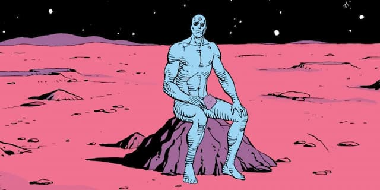

_Dr. Manhattan, o (quase) onisciente personagem de Watchmen, série em quadrinhos de Alan Moore._

A guerra da Ucrânia tem me deixado meio maluco. Muitas informações conflitantes e previsões catastróficas. Para manter a sanidade, pensei em ligar para o meu psicanalista, Dr. Distopia. Mas isso seria pior. O que eu precisava mesmo era de um certo conforto, de uma massagem relaxante, algo assim. Então, decidi visitar minha terapeuta holística, Ganesha da Silva.

Como sempre, ela me recebeu com incensos e óleos essenciais (que não vêm da Rússia, aparentemente). Expliquei meu problema. Ela sorriu, me pediu para deitar na maca e começou a falar, com aquele tom calmo de aplicativo de meditação.

“O que a guerra na Ucrânia está dizendo **sobre você**? Como você vem acompanhando o conflito? Que tipo de padrões psicológicos e culturais está reproduzindo? Quais comportamentos não enxergava em si e passou a perceber agora?“

Não era exatamente para responder, apenas para refletir.

Por um lado, essas questões me soavam ridículas. Um luxo, permitidas apenas para quem não tem que se arriscar, fugir para outro país, enfrentar racismo ou ver sua carreira, perspectivas e poder aquisitivo ruir em apenas alguns dias.

Por outro, eu sabia que todo conflito causa seus [efeitos borboleta](https://en.wikipedia.org/wiki/Butterfly_effect) econômicos, sociais, políticos e, consequentemente, psicológicos.

Ganesha parecia ouvir meus pensamentos:

“Ainda que haja manipulação da opinião pública e guerra de narrativas, de alguma forma, ainda há como pisar no freio e investigar: o que a guerra está fazendo comigo?“

Como assim, perguntei. Ela continuou, no mesmo tom “primeira pessoa-genérica”:

“Meu comportamento também está mais bélico, causando problemas no meu próprio círculo (perceptível) de influência? Minha necessidade de escapismo aumentou? Meu desejo de ser o centro das atenções, de posar de especialista, de ser aceito, essas coisas diminuíram, aumentaram, mudaram de estilo? Quais são as razões ocultas por trás dos meus apoios, críticas e desconfianças?“

Também não era, exatamente, para responder, mas argumentei mesmo assim:

“Por exemplo, ao escrever meus textos, observo meu medo de rejeição, de ser considerado raso e classificado como _#autoajuda_. Um crítico interno cobra por — pelo menos — uma indicação de livro ou artigo que agregue uma tag mais respeitada ao meu _self fragmentado_“.

Ganesha virou os olhos para cima, balançou levemente os ombros de lá para cá, e apenas emitiu um som como “hummmmm”, que entendi como permissão para continuar minha autoanálise.

“Outra parte de mim, responsável pela equipe de manutenção do ego, se justifica: não é isso que autores como Susan Sontag, Primo Levi, entre outros, faziam? Mostrar a irracionalidade emocional que fundamenta situações de conflito? Você vai esperar a guerra acabar para **olhar para dentro**?”

Ganesha sorriu: “Mas que arrogância ingênua deliciosa”.

“Ah, é o velho _bug da linguagem_“, respondi. Ela me lambuzou com alguma substância fedorenta, apertou meus glúteos e seguiu:

“Nesse momento, imagine se você pudesse ouvir os pensamentos dos imperialistas norte-americanos, dos presidentes-influencers, do autocrata Russo, dos bilionários oligarcas, dos hackers, dos manipuladores de informação, dos empresários solucionistas, dos especialistas, dos tiozões do churrasco, dos soldados, dos refugiados, dos poloneses vendo milhares de pessoas surgindo de repente, dos voluntários militares, dos turistas sexuais…“

“Basicamente, você quer que eu seja onisciente?”, interrompi. Mas ela não se sentiu compelida a parar:

“O que alguém (ou uma máquina) realmente onisciente enxergaria numa guerra?“

“Hmm. Sairia de cena, como um [Dr. Manhattan](https://en.wikipedia.org/wiki/Doctor_Manhattan)?“

“Ou se envolveria ainda mais, por compaixão geral e irrestrita, por todas as partes envolvidas? Por se sentir pertencente à comunidade desse planeta impermanente.“

“Difícil de garantir.“

As questões fluíam, sem resposta. Mas a tensão por trás delas, de alguma forma, ia se dispersando junto com o incenso. Senti-me culpado e relaxado, ao mesmo tempo. Pensei que, talvez, os serviços de Ganesha pudessem ser usados nas relações internacionais. Não é que ela resolva, mas muda o foco.

“Onisciente…”, repeti, sem pensar muito. Ela retrucou:

“Por enquanto, siga tentando ser um pouco mais ciente de si mesmo. Pelo menos.“

É. Faz algum sentido.
