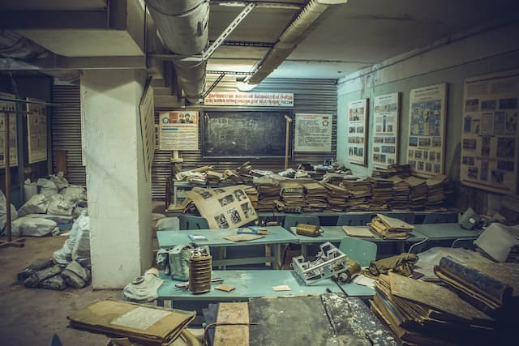

Vamos fazer um exercício futurológico. Uma espécie de utopia cheia de cicatrizes e remendos com durepox. Quase como no livro (e série) [Estação Onze](https://www.amazon.com.br/Esta%C3%A7%C3%A3o-Onze-John-Mandel-Emily/dp/8580577071?&linkCode=ll1&tag=eduf-20&linkId=d6267dbf34e91c51001ee10744b8df65&language=pt_BR&ref_=as_li_ss_tl), de St. John Mandel.

Primeiro, vamos aceitar os seguintes cenários:

1. A inteligência artificial assumiu a maioria dos nossos postos de trabalho. Poucas pessoas têm empregos, como conhecemos hoje.
2. Vivemos de renda mínima (via Estado) e “pedacinhos” de investimento, aplicados no capital financeiro.
3. Ao mesmo tempo, o aquecimento global provocou uma real crise ideológica na sociedade de consumo. Comprar virou sinônimo de burrice.
4. As circunstâncias nos obrigaram a resgatar o talento para reciclar materiais, fuçar no lixo, ressignificar objetos cotidianos e encontrar saídas criativas.
5. Artistas perderam o status de seres especiais. Como todos temos mais tempo livre, porém pouco dinheiro e recursos naturais, voltamos a criar diariamente, mas sem _big deal_, sem competitividade e sem mercado.
6. Como ainda acontece com certas sociedades nativas, a criatividade e o fazer manual estão mais vinculados à família, identidade, religião e relações interpessoais.

Talvez nosso cotidiano fosse inseparável de certo humor, bricolagem, sujeira, habilidades manuais e alguma abstração (quer dizer, ideias e objetos malucos que não pareceriam ter utilidade imediata). Mais para fanzine do que para livro de mesa.

Como seriam esses criadores e desenvolvedores de tecnologias? Eu arriscaria algo como o escultor [Tom Sachs](https://www.youtube.com/watch?v=d5IWhSKeZdc), os artistas plásticos Vik Muniz, [Mark Bradford](https://www.youtube.com/watch?v=jp9ck6IOkY0), [El Anatsui](https://www.youtube.com/watch?v=_d3RIE195JI), [Henrique Oliveira](https://www.youtube.com/watch?v=ajLfU6Hjwow), [Kaz Oshiro](https://www.youtube.com/watch?v=WFB8qsXPLJY), o cineasta [Ed Wood](https://www.youtube.com/watch?v=CawVaHxWvnA), a banda Devo. E por aí vai.

Hoje, criadores como estes vivem num universo paralelo de ter que definir o que é arte e em que contexto deve ser consumida. Mas imagine se tudo isso fosse esquecido, se galerias, prestígio, preços e rankings fossem coisas do passado. Se a tosquice imperasse universalmente.

Quer dizer, de certa forma, já impera. É uma espécie de força da natureza. Você relaxa um segundo e a tosquice se instaura em todos os cantos.

A sociedade industrial do pós-Segunda Guerra vem tentando nos convencer de que a realidade precisa ser asséptica, branca, cheia de vidros e plástico. Mas é claro que isso sempre escondeu todo tipo de caos político e de “improviso” social.

Nem mesmo a escola [Bauhaus](https://en.wikipedia.org/wiki/Bauhaus) escapou de alguma ferrugem, parafusos tortos e ratos escondidos no concreto. Se você olhar a cultura clássica grega no microscópio, encontrará gente como o filósofo mendigo [Diógenes de Sinope](https://pt.wikipedia.org/wiki/Di%C3%B3genes_de_Sinope), que morava num barril e dizia coisas inconvenientes para seus contemporâneos.

Enfim, dentre todas as possibilidades de futuro, sempre nos fixamos nos extremos da utopia ou distopia. Mas há muito espaço ali no meio. Num deles, talvez esteja a toscopia, com seu sorriso amarelo, roupas remendadas e palavras mal pronunciadas.

Alguém aí quer comprar os direitos para o filme?
