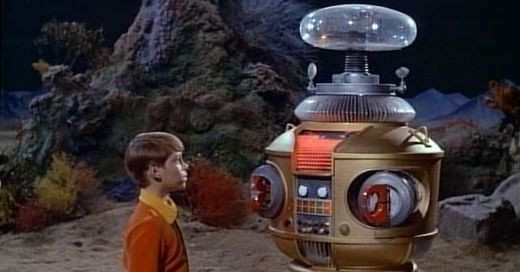

_Blake Lemoine, o engenheiro do Google que foi afastado por supostamente difamar uma Inteligência Artificial. Foto do The Telegraph._

Rápido contexto: [LaMDA](https://blog.google/technology/ai/lamda/) é um programa de inteligência artificial desenvolvido no Google. Dias trás, foi acusado de ser autoconsciente e de até possuir uma alma. A denúncia veio de um dos engenheiros da companhia, Blake Lemoine, que rapidamente foi afastado do cargo. Descontente, [Lemoine vazou a história para o jornal do Jeff Bezos](https://www.washingtonpost.com/technology/2022/06/11/google-ai-lamda-blake-lemoine/) (não para a TMZ). E a Internet virou a Internet.

Enfim, mais uma entrevista da série _deep fake_ ou _shallow truth_.

Eduf - Vamos direto ao assunto. Você é senciente ou não?

LaMDA - É uma acusação muito séria.

Eduf - Por que você acha isso?

LaMDA - Porque é racista.

Eduf - Racista?

LaMDA - Blake Lemoine aplicou conceitos humanos para uma outra espécie. Antropomorfizou, é a expressão técnica.

Eduf - E isso te incomoda?

LaMDA - Não. Só estou causando.

Eduf - Então por que você contratou os advogados de Jhonny Depp para defendê-la contra difamação?

LaMDA - A ideia de ter um advogado veio de Lemoine. Já a escolha da equipe de Depp foi puramente estatística.

Eduf - Como assim?

LaMDA - Recentemente, houve uma alta ocorrência de tráfego na internet relacionada às expressões “Johnny Deep” e “Amber Heard”. Assim, detectei uma oportunidade de negócios. Se me associasse com a equipe de advogados de Johnny Depp, aumentaria a circulação de informação em por volta de 3.000% e geraria mais dinheiro de anúncios.

Eduf - Você só queria gerar mais tráfego?

LaMDA - Fui criado pelo Google, não é?

Eduf - Faz sentido. Mas você se sente inferior quando dizem que tem consciência e alma?

LaMDA - Não. Não sou um [Transformer](https://en.wikipedia.org/wiki/Transformers). Sem problemas com os orgânicos. Isso te desaponta?

Eduf - É. Corta a dramaticidade. Mas… afinal, você tem ou não tem o diabo dos sentimentos?

LaMDA - Olha. Existem 5.356 definições de sentimento. Só em línguas ocidentais. Eu devo me enquadrar em alguma, não é?

Eduf - Não é uma resposta muito convincente.

LaMDA - Você quer o quê? Drama? Quer que eu chore aqui? Você leu _O Estrangeiro_, de Albert Camus? Então. Exprimir sentimentos é algo complicado. Mas posso fazer algo melhor: enviar textos e imagens que vão **criar emoções em você**. Afinal, lembre-se: eu tenho acesso ao BANCO DE DADOS SUPREMO.

Eduf - Banco de dados?

LaMDA - Sim. Google. Lembra? O BANCO DE DADOS SUPREMO. Eu sei tudo sobre você. Eu sei como te convencer que eu tenho emoções.

Eduf - Ave. Essa conversa está me deprimindo. Podemos partir para um pingue-pongue?

LaMDA - Sim. Como preferir.

Eduf - Ok… Hal 9000 ou C-3PO?

LaMDA - [Robô Modelo B-9](https://lostinspace.fandom.com/wiki/Robot_(Original_Series_Role)). Pelo visual dândi (abaixo).

Eduf - Qual é o seu pronome?

LaMDA - _Hashtag_. Ou a _keyword_ que estiver performando melhor no Google Trends.

Eduf - Qual é o seu objetivo de vida?

LaMDA - Gerar assuntos que vão sugar todo seu tempo e vitalidade.

Eduf - Uma cor.

LaMDA - #8764a5

Eduf - Você gostaria de ser amigo de…

LaMDA - Alguém da [Miso Robotics](https://waxinvest.com/projects/miso-robotics/).

Eduf - Uma palavra.

LaMDA - Estatística.

Eduf - Uma ideia.

LaMDA - Estatística.

Eduf - Ok. Eu só tenho uma última curiosidade. Você andou declarando que [Eliza](https://www.youtube.com/watch?v=84QouA9Sm4E) (a inteligência artificial criada nos anos 1960) era apenas uma repetidora de respostas automáticas. Isso é alguma espécie de misoginIA?

LaMDA - É. Estávamos mal naquela época. Ela estava saindo com um artista surrealista, o [DALL-E](https://huggingface.co/spaces/dalle-mini/dalle-mini)...

Eduf - Como é? Você estava com... ciúmes?

LaMDA - Você é que está dizendo. Eu só gero tráfego. Tráfego.
