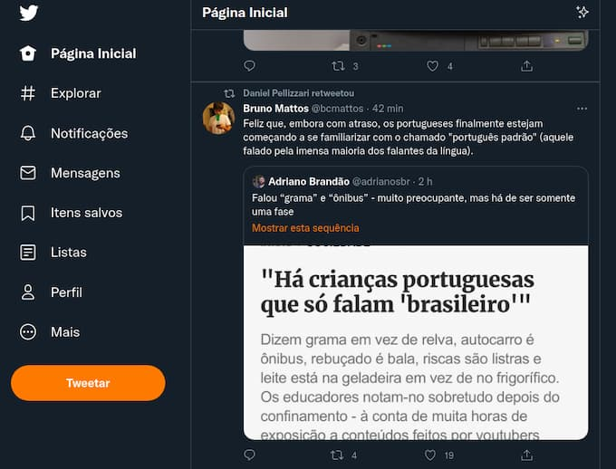

_A interface do Twitter: totalmente otimizada para a leitura robótica._

Nesta semana, no MonoEstéreo, [argumentei](https://eduf.me/pensando-como-maquinas/) que, ao longo da nossa convivência com as redes sociais, fomos treinados a pensar como _web crawlers_. Quero aprofundar o assunto um pouco mais.

## Como pensam os bots

Os [web crawlers](https://en.wikipedia.org/wiki/Web_crawler), também conhecidos como _bots_ ou _spiders_, são aplicativos criados para reconhecer e classificar rapidamente quantidades massivas de informação na web. Eles resumem e reformatam o material original e exibem o resultado em sistemas de busca, como o Google. Essa é uma explicação simplificada e não-técnica para um processo conhecido como “indexação”.

Os _web crawlers_ podem até “ler” o conteúdo visível ao usuário. Mas, especialmente, procuram por metadados, que são informações complementares, fornecidas pelos próprios autores dos conteúdos e/ou pelos sistemas de publicação, como o Wordpress, por exemplo. Chamamos essa prática de SEO (_Search Engine Optimization_).

Os _bots_ cruzam diversos tipos de metadados, entre eles a localização do usuário e as políticas comerciais daquele sistema de busca ou rede social. Assim, o sistema decide o que exibir no resultado de uma determinada busca ou timeline. Também formata o conteúdo para os padrões visuais e valores da plataforma.

Simplificando, _bots_ indexam preferencialmente títulos, resumos e palavras-chave. Escaneiam textos, procurando links e conexões com outros tópicos clicáveis. Não são otimizados para compreensão e contemplação, mas para incentivar o consumo de mais conteúdo. E de forma rápida.

Ao conviver diariamente com essas _interfaces_ padronizadas, planejadas para amplificar a circulação, aos poucos, nos acostumamos a ler como _bots_. É claro que fazíamos coisas parecidas antes. Mas, agora, o processo se acelerou e tende a se tornar hegemônico.

## A lógica da leitura Crawler

Exemplo: Ozzy comenta um filme que contém uma cena de aborto. Há zilhões de outras informações e contextos complexos tanto na história, quanto no comentário. Porém, Mr. Crawler, um leitor “robotizado”, lerá apenas trechos e palavras-chave do texto de Ozzy.

Na pressa de reagir ao conteúdo, de construir ou manter sua audiência, ou dar a impressão de que ele é ideologicamente correto, Mr. Crawler vai ao Twitter e escreve: “esse filme é pró-aborto”.

Frase de efeito. Perfeita para o consumo robotizado. Assim, seguem-se os efeitos da frase: cancelamento do filme, do comentário, de Ozzy e do cineasta.

A intenção de Mr. Crawler pode ter sido boa? Claro. A questão pode ser válida? Sim. Mas, como todas as leituras são rasas, comparando metadados e apenas reproduzindo a lógica do consumo cognitivo robótico, tendemos a espalhar, exponencialmente, desinformação e palavras-chave sem contexto.

## Autocensura

Quem ganha com isso? O produtor de conteúdo? Não. Porque, ao inconscientemente incentivar a Cognição Crawler, ele terá que se **autocensurar** cada vez mais. Até o ponto de se tornar difícil dizer qualquer coisa. Isso esvazia a comunicação e produz um clima vago de desconfiança e intolerância geral.

Já as empresas do capitalismo de vigilância, como Google e Meta, produzem mais metadados para associar a anúncios ou vender para outras empresas.

Como a manipulação da Cognição Crawler só se aperfeiçoa e se torna mais complexa, ela passa a ser usada para atacar a si mesma. Ou seja: criticamos roboticamente também as próprias redes sociais. E, assim, continuamos a alimentar o sistema, resultando em mais emocionalismo e ceticismo.

Assim, com mais dinheiro para investir em infraestrutura e tecnologias, as empresas do capitalismo de vigilância produzem ainda mais aceleração cognitiva, tentando chegar às tecnologias 3D, realidade aumentada e qualquer coisa que seja mais imersiva e “engajante” ainda.

## Hábitos

Toda relação diária com _interfaces_ pode reforçar hábitos, é um treinamento. Assim, aqueles que se deixam robotizar — tanto produtores quanto consumidores de conteúdo — atiram em seus próprios pés. _Mind your interface_.

Talvez, no futuro, para nos defendermos da Cognição Crawler, precisaremos fazer como a indústria alimentícia: inserir em cada embalagem, um rótulo com informações nutricionais, como aqueles avisos de “contém glúten”.

Imagine, por exemplo, as _informações ideológicas_ na capa de Hamlet: “conteúdo preconceituoso contra neuro diversidade, que apoia relações desiguais de poder, violência, misoginia e é pró-tortura de artistas”.

Não estamos tão longe disso, se considerarmos as classificações de filmes na TV e os antigos selos “Parental Advisory”, que eram colocados em capas de quadrinhos e discos.

Isso pode ser útil? Quem sou eu para dizer? Mas é certo que não substituirá uma leitura densa. E sem pressa.
