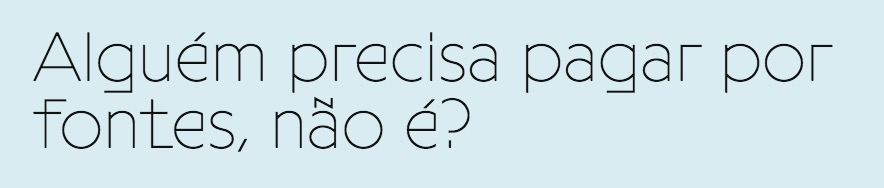

Bom dia.

Eu disse que iria dividir a newsletter em duas: opiniões (enviada às quartas) e links (aos sábados, quando der). A ideia é deixar as duas mais curtas e fáceis de fazer. Assim nem você e nem eu ficamos _burn out_. Então, aqui vão alguns links selecionados diretamente da minha bolha. Tendo sugestões, envie respondendo este e-mail.

Obrigado por ler.

Eduf

* * *

## Novo podcast

Não é que meu antigo podcast com o [Eduardo Pinheiro](https://tzal.org) está de volta? Agora chama-se [A Hora do Diletante](https://eduf.me/a-hora-do-diletante/).

* * *

## Desafio nutricional

O Daily Dozen é um aplicativo desenvolvido pelo time do [Nutrition Facts](https://nutritionfacts.org/), um dos melhores sites pra se aprofundar na dieta e estilo de vida vegano. Lá você encontrará um desafio nutricional, que otimiza sua alimentação pra [extrair o máximo de nutrientes com o mínimo de tempo / esforço](https://nutritionfacts.org/daily-dozen-challenge/). Vale tentar.

- [App pra IOS](https://apps.apple.com/us/app/dr-gregers-daily-dozen/id1060700802)
- [App pra Android](https://play.google.com/store/apps/details?id=org.nutritionfacts.dailydozen&hl=en&gl=US)

* * *

## Feia mas bonita

Sou suuuper ranzinza em relação a modas, mas tem uma que me pegou: a das fontes "com formas polêmicas". Ainda que esse visual deva ficar datado em breve, algumas fontes são bem legais. Exemplos:

- [Programme Primitive](https://optimo.ch/typefaces/programme) (imagem acima)
- [Soria Font](https://upfonts.com/soria-font/)
- [Gosha Sans](https://www.behance.net/gallery/66713707/Gosha-Sans-gosha-bez-Free-Font)

* * *

## Sustentabilidade está na moda

Como a indústria de roupas começa a [investir em sustentabilidade](https://hothouse.substack.com/p/fashion-business-as-usual-is-no-longer?token=eyJ1c2VyX2lkIjoxNDU4ODM2NywicG9zdF9pZCI6MzI4MzU5ODIsIl8iOiJkZ1NmNCIsImlhdCI6MTYxNDA4MzAwNCwiZXhwIjoxNjE0MDg2NjA0LCJpc3MiOiJwdWItMjA2NDYiLCJzdWIiOiJwb3N0LXJlYWN0aW9uIn0.6OViEjurNjVISIstTi3yY2mKoAwJ8XoIu25LPBDTAco).

* * *

## O que a tecnologia entende por "pensar"

Na lista de leituras: [What Tech Calls Thinking](https://logicmag.io/what-tech-calls-thinking/), de Adrian Daub. O professor de literatura em Stanford investiga e desmistifica conceitos familiares pra quem acompanha o noticiário de tecnologia: "falhar melhor", "disrupção", entre outras ideias duvidosas. Daub resume sua pesquisa [nessa entrevista](https://podcasts.apple.com/us/podcast/adrian-daub-author-what-tech-calls-thinking-from-feb-1-2021/id1285537944?i=1000507374323) ao programa Techtonic, da [WFMU](https://wfmu.org/) ([minha rádio favorita](https://eduf.me/o-esprito-do-rdio/)).

* * *

## Que mané Clubhouse

Você precisa mesmo se engajar na [moda planetária do Clubhouse](https://restofworld.org/2021/four-countries-one-clubhouse/) (rede social pra áudio)? Saiba que ele vai pedir acesso a todos os seus contatos… Enfim. Já há uma versão open-source desse tipo de programa, o [Jam](https://jam.systems/). E vem até com [possibilidades de monetização](https://gitlab.com/jam-systems/jam).

* * *

## No [Eduf.me](http://Eduf.me)

- [Wordpress vai virar monopólio?](https://eduf.me/wordpress-vai-virar-monopolio/)
- [Engajamento de usuário é eufemismo pra vício](https://eduf.me/engajamento-de-usuario-e-eufemismo-pra-vicio/)
- [Tudo sobre o metaverso](https://eduf.me/tudo-sobre-o-metaverso/)
- [Kit pra entender o pós-crescimento](https://eduf.me/kit-pra-entender-o-pos-crescimento/)

## Ainda não cansou?

- [MonoEstéreo - podcast](https://eduf.me/podcast/)
- [Falso Profundo - seriado de ficção científica em áudio](https://eduf.me/tag/falso-profundo/)
- [Telegram](https://t.me/edufme)
- [Mastodon](https://mastodon.social/@eduf)

* * *

## **Apoie**

### **Ajude a preservar seu produtor cultural local.**

Qualquer contribuição me possibilita a ter mais tempo pra escrever e produzir coisas gratuitas pra internet.

### **Transferência única**

- [Nubank](https://eduf.us5.list-manage.com/track/click?u=54a934b9aa7d008b9bb575d47&id=e879d8b961&e=85ed5a88c6)
- [PicPay](https://eduf.us5.list-manage.com/track/click?u=54a934b9aa7d008b9bb575d47&id=0d81ec46c6&e=85ed5a88c6)
- [PagSeguro](https://eduf.us5.list-manage.com/track/click?u=54a934b9aa7d008b9bb575d47&id=e80e4ef0f6&e=85ed5a88c6)
- [PayPal](https://eduf.us5.list-manage.com/track/click?u=54a934b9aa7d008b9bb575d47&id=a9b758a8f3&e=85ed5a88c6)
- [pix@eduf.me](mailto:pix@eduf.me)

### **Assinatura mensal**

- [Valor livre, via Mercado Pago](https://eduf.us5.list-manage.com/track/click?u=54a934b9aa7d008b9bb575d47&id=97a43948c4&e=85ed5a88c6)
- [R$10, via PagSeguro](https://eduf.us5.list-manage.com/track/click?u=54a934b9aa7d008b9bb575d47&id=94de3fdb2d&e=85ed5a88c6)
- [Planos de R$5 a R$50, via PicPay](https://eduf.us5.list-manage.com/track/click?u=54a934b9aa7d008b9bb575d47&id=977e915c36&e=85ed5a88c6)
