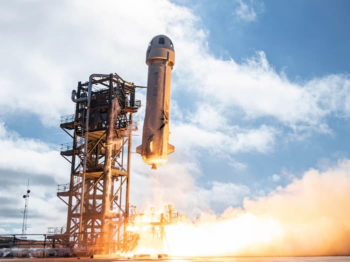
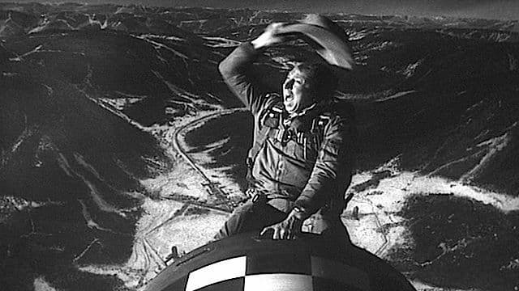

Então é isso: o dono da Amazon, Jeff Bezos, foi para o espaço, ficou cerca de 12 minutos por lá e voltou são e salvo. Pequeno passo para um bilionário, grande para a humanidade.

Assim como na chegada da Apolo 11 à Lua, em 20/07/1969, muitos de nós assistimos ao evento por meio de uma tela. Naquela época, no dia seguinte, pela TV. Agora, em “tempo real” e pela Internet.

## Eu paguei por isso

É a primeira vez que eu me sinto realmente financiando uma viagem espacial. Todas aquelas caixas e papéis pardos, de alguma forma, viraram combustível para o projeto de Bezos.

Ooook.

Definitivamente, a nossa era é bem mais _bootstrap_ do que a da primeira corrida espacial.

Não era mais ou menos isso que os punks queriam? Faça você mesmo. No caso, com meu dinheiro.

Antes, o astronauta precisava ser um cientista, financiado pelo Estado. Carregava toda a simbologia da Guerra Fria nas suas roupas acolchoadas, herméticas e brancas.

Agora são bilionários, com indumentárias coloridas, chapéus de cowboy, financiados coletivamente, via Internet.

E, perceba: no caso de Bezos, **voando num foguete claramente fálico**.

Alguém aí se lembrou da cena final de Dr. Fantástico, do Stanley Kubrick?

> We meet again / Don't know where / Don't know when

Agora sabemos: em 2021, cavalgando uma nave, em vez de uma bomba.

## Novas metáforas

De alguma forma, nossa época está mais para pioneirismo e escapismo do que para heroísmo e confronto.

Em vez de sacrifício masculino kamikase, jogar-se alegremente com a bomba, nossa simbologia é a do empreendedorismo, do desbravamento do Novo Oeste Cósmico. [Space Cowboy](https://www.youtube.com/watch?v=OPkjnRIdQXQ).

Por enquanto, ainda estamos surfando no quintal do Planeta. Logo mais, liberaremos nossas flatulências na Lua ou Marte.

## Ops. Espere aí

O texto está com um tom um tanto ácido, mas me esforço para não cair numa energia de “zombaria de rede social”. Ou de guerra santa entre explorados e exploradores.

Eu queria mesmo é olhar para a simbologia da nossa época. Esses indivíduos turbinados por dinheiro, velocidade e entusiasmo. Mas também por identidade e autoafirmação, em seus Falos Voadores.

Falos das Galáxias. É o exemplo mais potente de aumento de pênis que já circulou pela Internet. **O spam supremo**.

Esse vírus que está nos bilionários, também circula em nossos corpos e mentes. Esse ímpeto de dobrar o universo às nossas vontades, de mudar (e “melhorar”) tudo ao redor. Esse temor de qualquer coisa que se pareça com estagnação e incerteza. _Sapiens-demens_.

Se eu tivesse recursos suficientes, também sairia por aí, desesperado, com objetos fálicos, furando túneis ou penetrando a atmosfera?

Vai saber.

Cada um tem um jeito de experimentar, dia após dia, o poder dos hábitos do chamado Reino do Desejo. [Om Ami Dewa Hri](https://en.wikipedia.org/wiki/Amit%C4%81bha).
