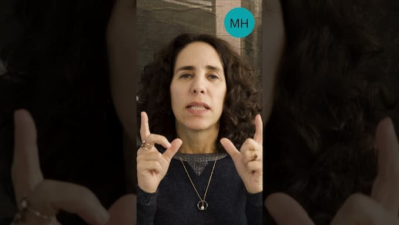

_A estética dos shorts também pode ser um tanto claustrofóbica: pessoas e ideias comprimidas num retângulo e na velocidade._

Ocasionalmente, tenho uns momentos de _estranhamento cognitivo_(EC). Estou fazendo algo trivial e, de repente, tudo aquilo parece um grande absurdo: "isso sou eu? São assim que as coisas funcionam? Que maluquice". Feliz ou infelizmente, isso dura só uns poucos segundos.

Meu último EC apareceu ao acessar o Youtube. O algorítimo vem me sugerindo "shorts" da psicanalista Maria Homem, além de episódios do Café Filosófico. Então, lá estava eu, meio que paralisado, pensando: "o que são esses vários quadrados com gente se oferecendo para falar?" Até mesmo psicólogos, cuja profissão é essencialmente ouvir.

## Linha de cognição

O YouTube Shorts é uma tentativa do Google de concorrer com o TikTok. A ideia é facilitar ao máximo o processo de falar, de opinar e de reagir. Deixar tudo o mais rápido possível, enquanto ainda não conseguimos automatizar e delegar a tarefa para as próprias máquinas. Mais um passo na industrialização da cognição.

**Os shorts não são necessariamente superficiais**. Por exemplo, alguns de Maria Homem poderiam ser horas de aula numa universidade. Mas, as mesmas ideias, quando aparecem num formato tão "viciado", associado ao entretenimento, acabam induzindo ao consumo superficial: mais um conteúdo da lista, outra peça para encaixar nessa linha de produção infinita.

Curiosamente, acabei de participar de um evento no qual, por vezes, recitávamos, por horas, um só texto de mais de 3 mil anos de idade. Que estranho, a partir do ponto de vista da estética short. Nela, o ideal seria consumir rapidamente "novidades" constantes. Mesmo quando sejam reciclagens de conceitos criados há séculos.

## Youtube de ouvintes

Mas eu falava daquele EC em relação ao Youtube. Perguntava-me como seria a Internet se, em vez de estar baseada no ato de falar, estivesse no de ouvir. Imagine que absurdo seria acessar o Youtube e encontrar inúmeros thumbnails com pessoas se oferecendo para ouvi-lo, em vez de "influenciá-lo".

Afinal, o que é mais influente, falar ou ouvir? Na psicologia, existe essa esperança de que certas epifanias aconteçam quando **escutamos nossas próprias palavras**: "é assim mesmo que penso? É isso que faço comigo?" Assim, o terapeuta também funcionaria como um espelho.

Imagine Youtubes, Tiktoks, Substacks, Twitters etc. cheio de ouvintes, repletos de espelhos. O que será que aconteceria?
