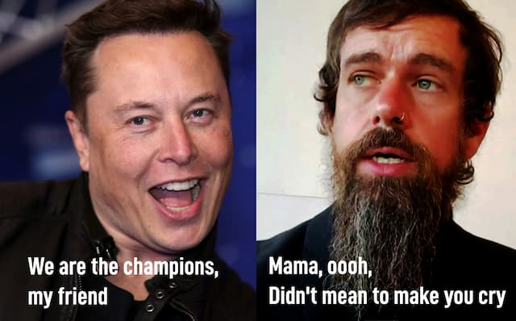
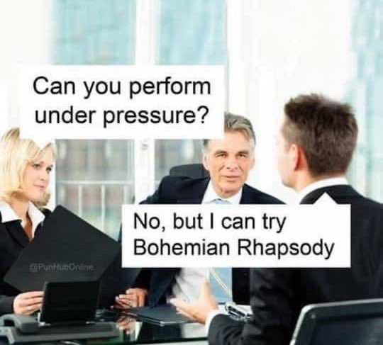
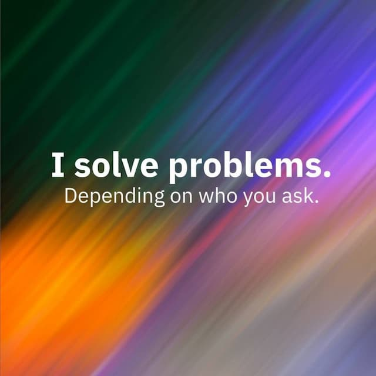

Então agora Elon Musk é o maior acionista do Twitter. E, aparentemente, a ferramenta se conecta ao seu [famoso master plan](https://www.bloomberg.com/news/newsletters/2022-04-05/elon-musk-s-plan-for-twitter-is-probably-more-than-speculative-investing).

Ao saber da notícia, meu primeiro ímpeto foi adicionar no currículo que sou funcionário dele -- o que, talvez, valorizasse meu passe. Mas a verdade é que praticamente nem uso o Twitter.

Ainda assim, o interessante é que a notícia saiu praticamente logo que o fundador, Jack Dorsey, publicou o seguinte texto, no perfil dele:

> "o tempo da usenet, irc, da web… mesmo do e-mail (com PGP)… era fantástico. centralizar a descoberta e a identidade em empresas danificou de verdade a internet. Entendo que parte da culpa é minha, e me arrependo."

De longe, parece que o Twitter está no meio de duas forças opostas: de um lado o dionisíaco, impetuoso, acelerado, Musk e, de outro, o autocrítico e pensativo Dorsey (que deixou de ser CEO da empresa faz pouco tempo).

Claro, hoje em dia, é de se desconfiar de que isso seja mais uma armação. Talvez, Dorsey e Musk estejam agindo coordenadamente num mesmo teatro _macho-man_, que visa concentrar todo o dinheiro e poder, antes que o planeta se dissipe via aquecimento global e/ou bombas. Mas quem sou eu para saber?

Vou tentar ser generoso e assumir que vemos aqui **dois estágios** do mesmo problema: o do solucionismo. Essa coisa do "eu resolvo, deixa comigo, sei o que fazer".

Musk ainda estaria no calor, no entusiasmo do solucionismo. Dorsey, no rebote, na visão de quem empreendeu e percebeu que não era bem assim, que a realidade não funciona só à base de entusiasmo individualista.

Outro dia, vi o seguinte meme:

Explico para os mais jovens: a piada é citar músicas de uma banda chamada [Queen](https://sc.wikipedia.org/wiki/Queen). Isso me deu a ideia de estender essa metáfora e propor que o solucionismo tem, pelo menos, 3 _fases queenicas_:

1. **We are the champions** - quando começamos um empreendimento, achando que as tarefas serão relativamente simples, que só precisaremos colocar energia e esforço para destrinchar a coisa toda. "Eu sou um resolvedor de problemas!"

1. **Under pressure** - quando percebemos que, como diz Nassim Nicholas Taleb, "é melhor não se meter com sistemas complexos". Ou seja: fica evidente que teremos que lidar com ciclos (naturais e humanos), descontinuidades, vieses múltiplos e novos problemas que surgem das soluções. Aí começamos a questionar entusiasmos simplistas. E a emitir alguns falsetes.
    
2. **Bohemian Rhapsody** - acontece quando falhamos e entramos num ciclo de vergonha e autopunição até infantil ("mamãe, eu matei um cara", "sou apenas um pobre sujeito, ninguém me ama"). Em casos mais extremos, caímos no _burn out_, falamos coisas sem sentido ("scaramooosh, scaramoosh"), buscamos escapismo ("mamamia let me go"), nos vitimizamos ("Belzebu designou um demônio para mim"), etc.
    

Não é que eu esteja advogando pela ausência de ação. Nem pretendo fundar uma nova seita [quietista](https://en.wikipedia.org/wiki/Quietism_(Christian_philosophy)). Mas, definitivamente, desconfio da epidemia de solucionismo, da proatividade cafeinada, de _macho-man_ bilionário disruptivo, de "resolvedores" individualistas de problemas. No limite, essa é a mentalidade que ajuda a fortalecer coisas como o neo-nazismo e o populismo.

Precisamos [rever a história da invenção](https://en.wikipedia.org/wiki/Connections_(British_documentary)) e essa valorização unilateral da "gente que faz", em detrimento daqueles que previnem, que agem no momento certo, dos que praticam humildade frente às múltiplas causas e consequências de cada ato. A partir daí, revalorizar a comunidade, a diversidade, a dinâmica e não somente o ritmo acelerado.

Musk pode ser um personagem divertido, com sua energia saltitante e seus planos mirabolantes. Mas, como todos nós, ainda é um gato brincando numa loja de cristais.

Vamos torcer para que Dorsey tenha realmente percebido algo semelhante sobre si mesmo. E que não vá aparecer em breve com outra ferramenta para tentar salvar o mundo.

Mas, claro: a vida também pode provar que estou errado -- o que acontece quase sempre. Nesse caso, qual é o link para instalar o novo aplicativo solucionista mesmo?
