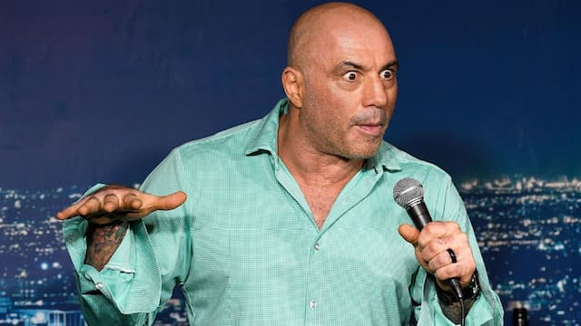

Você já teve a sensação de viver numa espécie de estação espacial, recebendo da Terra apenas comunicações fragmentadas, com latências e cheias de falhas? Foi mais ou menos o que senti ao saber das confusões envolvendo o termo Monark.

Não era uma bicicleta? Parece que não mais: agora, trata-se de um popular podcaster no Brasil. Como vivo isolado criogenicamente numa bolha, não o conhecia. Se entendi direito o que li na imprensa, hoje, as pessoas dão atenção a bêbados defendendo a legalização de um partido nazista.

Que coisa mais excêntrica.

Coincidentemente, soube que o bicho também pegou para o norte-americano Joe Rogan, que eu praticamente nunca vi. Parece que ele defendeu coisas indefensáveis sobre o COVID-19 e causou alguma confusão para o Spotify. Talvez você esteja melhor informado sobre essas mumunhas do que eu.

Desculpe minha ignorância. É que sou dinossáurico e um tanto elitista. Gosto de especialistas e estudiosos. Então, realmente, estava perdido em podcasts como [Team Human](https://www.teamhuman.fm/), [The Audio Long Read](https://www.theguardian.com/news/series/the-audio-long-read), [Resumido](https://resumido.cc/), [Guia Prático](https://manualdousuario.net/series/guia-pratico/), [Rádio Escafandro](https://radioescafandro.com/), [The Other Others](https://anchor.fm/tyson-yunkaporta), [Darknet Diaries](https://darknetdiaries.com/), entre vários outros, incluindo os que [eu mesmo produzo](https://eduf.me/podcast/). Enfim, me escapou essa tendência atual de **monetizar o tiozão do churrasco**.

[Um editorial](https://blogs.oglobo.globo.com/opiniao/post/caso-monark-expoe-limites-da-nova-comunicacao.html) do jornal O Globo disse parte do que eu pretendia escrever hoje:

> “Na diatribe libertária em defesa dos nazistas, Aiub (Monark) questionou se ‘as pessoas não têm o direito de ser idiotas’. Foi um argumento ridículo, pois nazismo é crime bárbaro e hediondo, não idiotice. Mas a frase define bem quem acredita nesse estilo de comunicação produzida por amadores sem nenhum conhecimento a respeito do que falam, princípios editoriais frágeis e compromissos éticos volúveis. Que tanta gente séria do universo político ou do mundo de negócios aceite tomar parte nisso dá uma boa medida da profundidade do buraco em que estamos metidos.”

Mas o texto ignora que existe um modelo de negócios por trás desse tipo de conteúdo. Spotify, YouTube e outras _bigtechers_ atuam no estilo surfista: aproveitam a onda enquanto possível e saem assim que ela se dispersa. Procuram outra e se esquecem da anterior.

É a lógica do extrativismo intelectual. Não há um cultivo de longo prazo, “sustentabilidade” ou ecologia cultural. Tal como existe hoje em dia, a economia dos criadores está baseada na velocidade, na volatilidade e na ausência de compromisso.

De perto, parece defesa da liberdade de expressão. Mas, a partir de um ponto de vista mais amplo, é só especulação financeira. “Deixe destruir o máximo possível, depois inventamos uma tecnologia para corrigir o problema”.

## Os novos palhaços

Sempre houve um espaço para a Comunicação Tiozão de Churrasco (CTC). “Lá vem aquele parente breaco, meio sem noção, falando besteira”. Ok. Quem o leva à sério? Ele perde meu tempo, mas garante um azeitamento social. Vem cá, tio, consigo amá-lo mesmo assim.

Tudo é uma questão de escala e contexto. Como comunicação de massas, como _business_, o fenômeno CTC é uma atualização de uma tradição muito antiga, a do palhaço. Ou do estilo Coyote, do Papa Léguas: o sujeito que se acha super esperto e que, cedo ou tarde, acaba sendo humilhado em público.

Pense bem: você seguiria certas ideias apenas por serem enunciadas por Rogan ou Monark? Compraria produtos só pelo fato de serem anunciados nesse tipo de podcasts? Provavelmente, não. Mas, potencialmente, eles nos roubam algo bastante precioso: o tempo.

Assim, não é que eles sejam exatamente influenciadores. Estão mais para profissionais de entretenimento, quase que anestésicos, criando sequências e mais sequências de momentos de alienação, que nunca mais nos serão devolvidos. Desviando a energia que poderia ser gasta em algo mais útil.

Até mesmo quando são pegos, quando falam besteiras intoleráveis, são usados como _entertainers_. Apelam a um certo desejo humano de assistir aos outros sofrerem e errarem em público. O mesmo que leva ao sucesso dos _reality shows_.

A grande pergunta é por que, afinal, no cotidiano, resolvemos dar atenção ao tiozinho do churrasco? Sabemos que, cedo ou tarde, ele aparecerá bêbado, falando besteira. Então, por que lhe damos corda para se enforcar?

Para o Spotify e YouTube, obviamente, é uma questão de dinheiro. Mas, para nós, por que ainda perdemos tempo com isso? Apenas pelo prazer de ver a expressão do Coyote ao descobrir que vai cair do penhasco?
