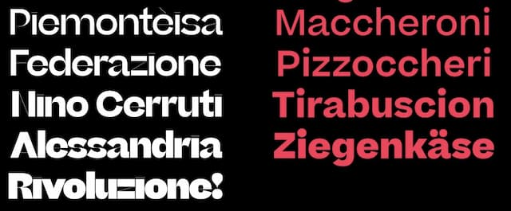
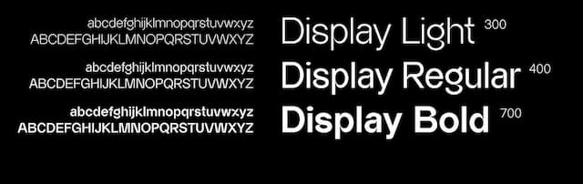
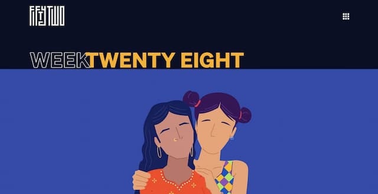

 Beatrice é a irmã descolada. Beatrice Display, a tia louca, revolucionária na juventude. [Specimen aqui](https://sharptype.co/typefaces/beatrice/#specimen "Beatrice fonts").

 Como descrever [Almarena Display](https://www.behance.net/gallery/102048615/Almarena-Typeface "Almarena Display")? É uma fonte "escorregadia grotesca"? Note o R maiúsculo e o S.

 O combate ao COVID-19 na Índia vai de mal a pior. Dá até uma certa dor na consciência de mostrar o site [Fifty Two](https://fiftytwo.in/ "52 site"), com histórias do país que raramente vemos na mídia. Mas, enfim, é um excelente design. Não posso deixar passar.

[Old Book Illustrations](https://www.oldbookillustrations.com/subjects/ "Ilustrações antigas gratuitas") traz centenas de ilustrações gratuitas pra usar naquele seu projeto de livro do século 19.
