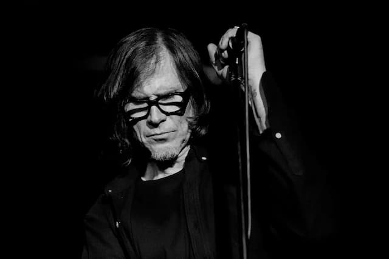

Estava agora mesmo pesquisando sobre [relações parasociais](https://en.wikipedia.org/wiki/Parasocial_interaction) quando soube que Mark Lanegan morreu, aos 57 anos. Sacanagem. Ele era uma das minhas intimidades imaginárias mais longevas.

Venho acompanhando a carreira de Lanegan desde os anos 1990, quando ele cantava na banda de neo-hard rock Screaming Trees. Desde então, sua produção se diversificou muito: participou da melhor fase do Queens of Stone Age, fez [dueto com Isobel Campbell](https://www.youtube.com/watch?v=iVvdEZdW8B0) e lançou vários álbuns solo — que circulavam do folk, pós-punk, até covers de músicas populares. Lançou [livros](https://www.amazon.com.br/Sing-Backwards-Weep-Portugu%C3%AAs-Mem%C3%B3rias-ebook/dp/B09N8QNZMW?keywords=mark+lanegan&qid=1645637450&sprefix=mark+lan%2Caps%2C487&sr=8-1&ufe=app_do%3Aamzn1.fos.fcd6d665-32ba-4479-9f21-b774e276a678&linkCode=ll1&tag=eduf-20&linkId=e466d80c73baebed44b729bb58455036&language=pt_BR&ref_=as_li_ss_tl) de [confissões](https://www.amazon.com.br/Devil-Coma-Mark-Lanegan/dp/1399601849?keywords=mark+lanegan&qid=1645637450&sprefix=mark+lan%2Caps%2C487&sr=8-4&ufe=app_do%3Aamzn1.fos.6121c6c4-c969-43ae-92f7-cc248fc6181d&linkCode=ll1&tag=eduf-20&linkId=676fe007ec7ee6e08fdedd4f9e5f8072&language=pt_BR&ref_=as_li_ss_tl) da sua vida louca, cuja [versão audiobook](https://www.youtube.com/watch?v=sali1Fn9JK8) é ainda mais apavorante. Inspirou até um [livro de colorir](https://www.amazon.com.br/Anxiety-Relief-Coloring-Book-Illustrations/dp/B09FS5CYRN?keywords=mark+lanegan&qid=1645637450&sprefix=mark+lan%2Caps%2C487&sr=8-8&ufe=app_do%3Aamzn1.fos.db68964d-7c0e-4bb2-a95c-e5cb9e32eb12&linkCode=ll1&tag=eduf-20&linkId=f496c26ee47ca87e13de1a8f47f8c83b&language=pt_BR&ref_=as_li_ss_tl) antiestresse (sério?).

Ou seja, como suas canções eram, em si, bastante autobiográficas e vulneráveis, eu tinha muito material para considerar Lanegan quase como meu chapa. Nem precisava da Internet para invadir sua privacidade, que era bem privativa, por sinal. Mark era, essencialmente, um introvertido. E eu me conectava com ele exatamente por isso, além da apreciação por vozes graves, músicas agridoces e personagens vira-lata.

Mas estava falando sobre interações parasociais. É um fenômeno muito antigo, estudado formalmente só a partir da popularização da TV. Você recebe tanta informação sobre uma pessoa, que parece que a conhece, que poderia mijar de porta aberta na sua casa.

As interações parasociais são um tipo de ficção bem democrático. Todos nós temos uns personagens de estimação que acompanhamos e achamos que conhecemos bem.

Porém, trata-se de mais uma ilusão. Nós apenas criamos, editamos, preenchemos lacunas e estabelecemos arcos narrativos a respeito deles. É um exercício de imaginação contínuo. E, hoje, graças às redes sociais, ainda mais imersivo: todos estamos a um passo de dar aquela escorregada, que pode trazer decepção, _plot twists_ ou até cancelamento.

Nem a morte é capaz de encerrar esse ciclo. É que vivemos em perpétuas viagens no tempo, mais ou menos como diriam os [traufamadorianos](https://en.wikipedia.org/wiki/Tralfamadore). O Lanegan de 2022 está fisicamente morto, mas sendo constantemente reconstruído, resignificado. Vários Lanegans, de diversas épocas, vivem ao mesmo tempo, assim que lhe damos atenção. Ainda assim, é a nossa própria interpretação de Lanegan, que dura alguns minutos, até mudarmos de ideia.

Talvez a única coisa que consiga mesmo “matar” uma relação parasocial é o excesso de intimidade. Nem precisa ser física. Basta obter informação demais, até enjoar e perder o interesse. A relação deixa de ser tão “dopaminante” (não produz mais tanta expectativa via dopamina).

Assim, parece injustamente fácil abandonar uma relação unilateral, baseada apenas no entretenimento. Mas que seja eternamente enquanto dure, e essa coisa toda. No caso de Lanegan, poderia ter durado bem mais.
